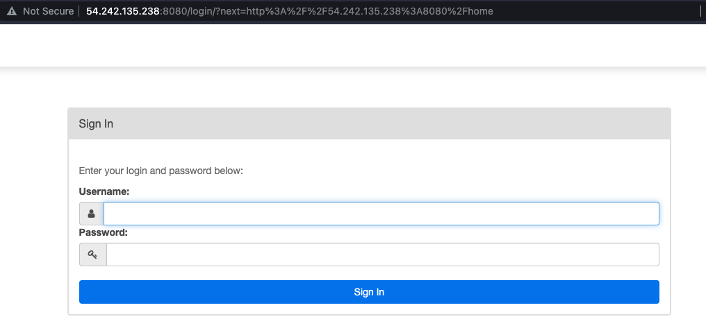

# Airflow EC2 Instance

## General description

This template generates an EC2 instance with Airflow running on the `8080 port`.
The generated instance has a security group that allows access and egress from all ports. This can be changed, however, for security purposes in the `main.tf` file.

The instance installs `docker` and `docker-compose` during the start-up. Other tools
can be installed during the start-up by modifying the `user_data` param from the `ec2_instance` resource in the `main.tf` file.

## Set up

The `terraform.tfvars` contains basic configurations for the instance and the AWS profile. The `profile` variable indicates terraform which AWS profile should be used to deploy the infrastructure. By default, terraform checks the AWS profiles in `~/.aws/credentials`.
The `AMI`, `instance type` and `instance size` can be also set there. This template uses by default a `t2.large` machine with a `ami-052efd3df9dad4825` AMI.

## Starting the instance

This instance can be initialized using the make command `make create-airflow-ec2` from the root directory of this repo or by running the following command within this directory:

``` bash
terraform init
terraform apply -auto-approve
```

## Accessing the Airflow Web App

Once the Airflow instance is `Running`, it's possible to access the Airflow Web App through the instance `Public IPv4 address` and the `port 8080`.  
The user is `airflow` and the password is `airflow`.




## Deleteing the instance

This instance can be deleted using the make command `make destroy-airflow-ec2` from the root directory of this repo or by running the following command within this directory:

``` bash
terraform destroy -auto-approve
```
